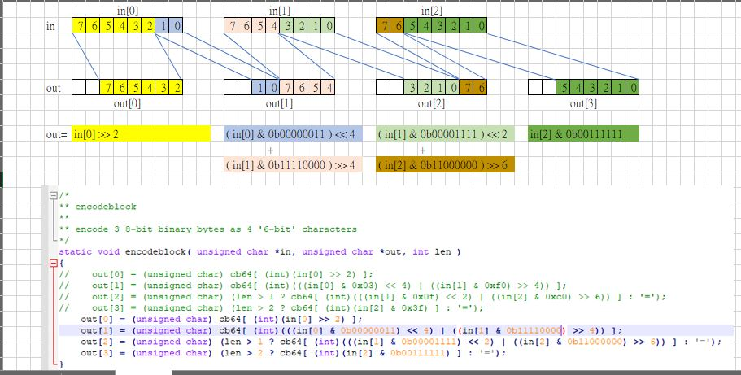

# Base64-encoder
for Wondows XP / win10, MASM source code, resource object &amp; make available. user input the string, i.e. user name &amp; password for email, the program will output the base64 encoded output  

original host, https://sourceforge.net/projects/base64-encoder/

mirror, easy code reading.

base64 encoding scheme, 3 bytes binary data to 4 byte ASCII  


  


base64 mapping table, A-Z, a-z, 0-9, +, /

C
```
/*
** Translation Table as described in RFC1113
*/
static const char cb64[]="ABCDEFGHIJKLMNOPQRSTUVWXYZabcdefghijklmnopqrstuvwxyz0123456789+/";
```  

asm
```
;Base64 -> ASCII mapping table
base64_table	db "ABCDEFGHIJKLMNOPQRSTUVWXYZ"
		db "abcdefghijklmnopqrstuvwxyz"
		db "0123456789+/="
```


reverse the process, build a table, sort the base64 map by ASCII order, for example  
```
+ = 0x2B = 43, the minum, index offset =0  
$ = 0x24 = 36, invalid char for base64, index offset = 1  
$ = 0x24 = 36, invalid char for base64, index offset = 2  
$ = 0x24 = 36, invalid char for base64, index offset = 3  
/ = 0x2B = 43, the minum, index offset = 4  
and so on....  
ｚ= 0x7A = 122, the maximum, index offset = 79  
```

static const char decode64map[]="+$$$/0123456789$$$=$$$$ABCDEFGHIJKLMNOPQRSTUVWXY$$$$$$$abcdefghijklmnopqrstuvwxyz";  

// index value
static const char decode64map[]="+$$$/0123456789$$$=$$$$ABCDEFGHIJKLMNOPQRSTUVWXY$$$$$$$abcdefghijklmnopqrstuvwxyz";  
static const char decode64indexvalue[]={62,'$', '$', '$', 63, };  


how about decoder

GITHUB table
| index_value | Base64_map | DEC | HEX | BIN | index_offset |
62|+|43|2B|00101011|0
63|/|47|2F|00101111|4
52|0|48|30|00110000|5
53|1|49|31|00110001|6
54|2|50|32|00110010|7
55|3|51|33|00110011|8
56|4|52|34|00110100|9
57|5|53|35|00110101|10
58|6|54|36|00110110|11
59|7|55|37|00110111|12
60|8|56|38|00111000|13
61|9|57|39|00111001|14
64|=|61|3D|00111101|18
0|A|65|41|01000001|22
1|B|66|42|01000010|23
2|C|67|43|01000011|24
3|D|68|44|01000100|25
4|E|69|45|01000101|26
5|F|70|46|01000110|27
6|G|71|47|01000111|28
7|H|72|48|01001000|29
8|I|73|49|01001001|30
9|J|74|4A|01001010|31
10|K|75|4B|01001011|32
11|L|76|4C|01001100|33
12|M|77|4D|01001101|34
13|N|78|4E|01001110|35
14|O|79|4F|01001111|36
15|P|80|50|01010000|37
16|Q|81|51|01010001|38
17|R|82|52|01010010|39
18|S|83|53|01010011|40
19|T|84|54|01010100|41
20|U|85|55|01010101|42
21|V|86|56|01010110|43
22|W|87|57|01010111|44
23|X|88|58|01011000|45
24|Y|89|59|01011001|46
25|Z|90|5A|01011010|47
26|a|97|61|01100001|54
27|b|98|62|01100010|55
28|c|99|63|01100011|56
29|d|100|64|01100100|57
30|e|101|65|01100101|58
31|f|102|66|01100110|59
32|g|103|67|01100111|60
33|h|104|68|01101000|61
34|i|105|69|01101001|62
35|j|106|6A|01101010|63
36|k|107|6B|01101011|64
37|l|108|6C|01101100|65
38|m|109|6D|01101101|66
39|n|110|6E|01101110|67
40|o|111|6F|01101111|68
41|p|112|70|01110000|69
42|q|113|71|01110001|70
43|r|114|72|01110010|71
44|s|115|73|01110011|72
45|t|116|74|01110100|73
46|u|117|75|01110101|74
47|v|118|76|01110110|75
48|w|119|77|01110111|76
49|x|120|78|01111000|77
50|y|121|79|01111001|78
51|z|122|7A|01111010|79


